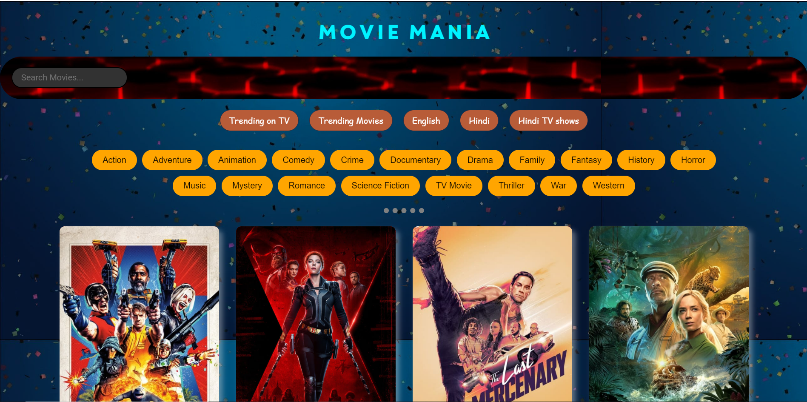
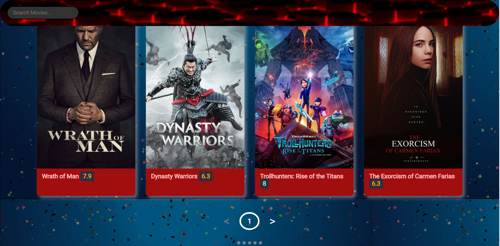
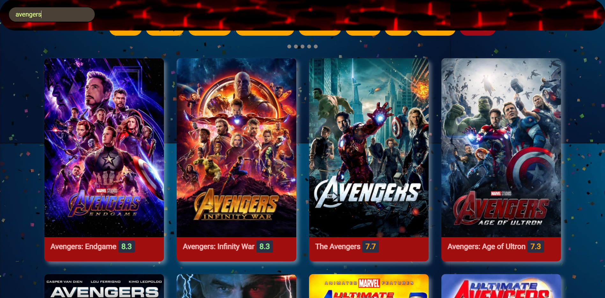

    
# Asci Project-Movie API Web Application
Movie Search Web Application 

## Team members
 1]@Swapnil Gite https://github.com/SwapnilGite
 2]@Mohan Mali https://github.com/MVMali

 ## Guided by
 1)Anjali Dofe
 2)Mrunal Kotkar
## Color Reference
   colorhunt.co

## API Reference
API used = tmdb api
#### Get movies by genre

```http
  GET /genre/list
```

| Parameter | Type     | Description                |
| :-------- | :------- | :------------------------- |
| `Genre` | `string` |Required-Api_key|


#### Get trending movies/tv by week

```http
  GET /trending/Movie/week
  GET /trending/tv/week
  
```

| Parameter | Type     | Description                       |
| :-------- | :------- | :-------------------------------- |
| `time_window`      | `string` |Required-Api_key  |

## Other References
    https://www.w3schools.com/
    https://developer.mozilla.org/
 
## Features
   - Search for a movie by typing name in the Search Box
   - See trending movies/tv shows by clicking on specific trending buttons
   - Hover/click on movie poster to read overview of the movie
   - Ratings of movie/tv shows are differentiated using proper colors
## Screenshots






  
